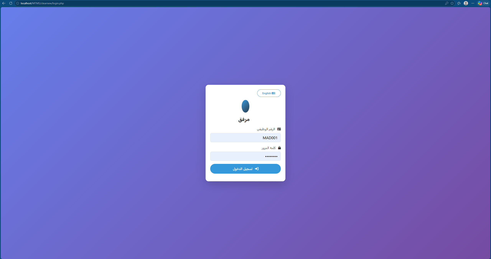
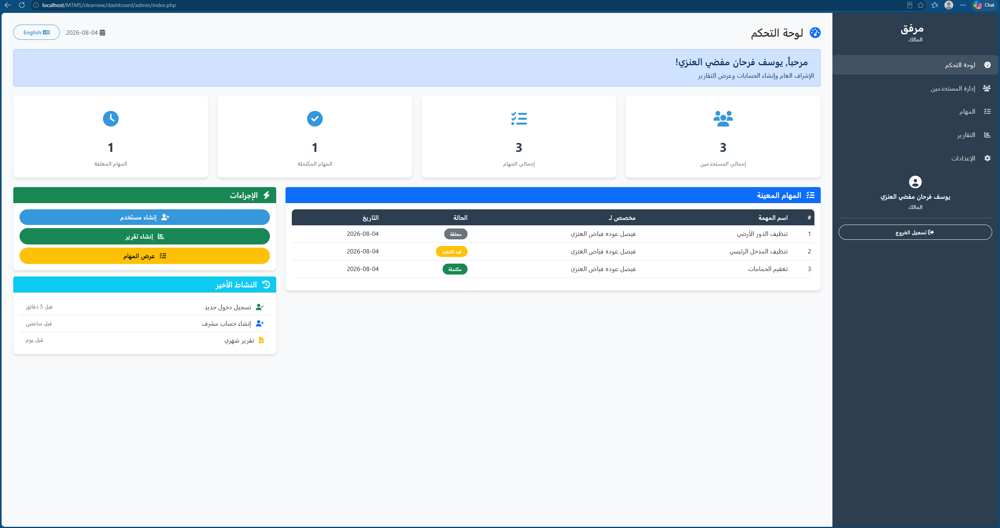
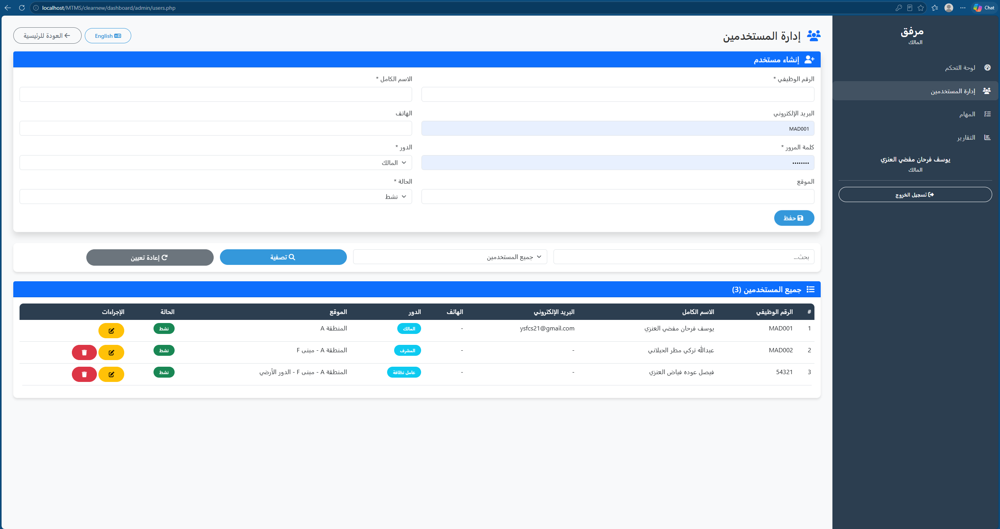
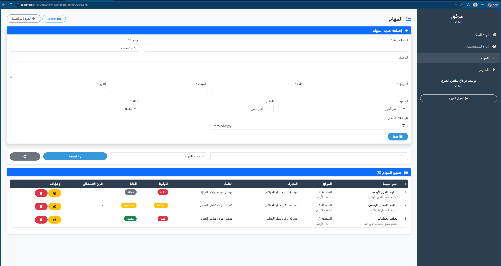
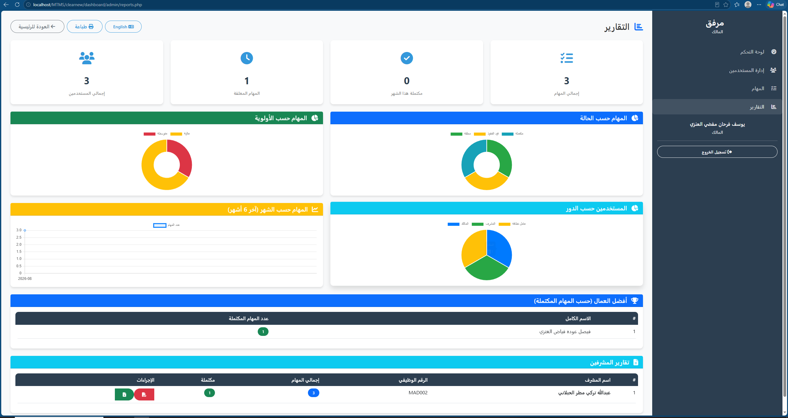

# Murafaaq System

A web-based facility and cleaning management system developed to organize daily operations, assign tasks, manage users, and generate reports.

## Overview

Murafaaq System is designed to simplify facility management by providing different dashboards for administrators, supervisors, and workers. The system helps organizations monitor tasks, users, attendance, and reports through a simple web interface.

## Features

- Secure Login System
- Role-Based Access Control
  - Administrator
  - Supervisor
  - Worker
- User Management
- Task Assignment & Tracking
- Reports Management
- Attendance Management
- Arabic & English Language Support
- Responsive Dashboard

## Technologies Used

- PHP
- MySQL
- HTML5
- CSS3
- JavaScript
- XAMPP

## Project Structure

```
clearnew/
├── assets/
├── dashboard/
├── includes/
├── uploads/
├── config.php
├── login.php
├── logout.php
└── database.sql
```

## Installation

1. Install XAMPP.
2. Copy the project into the `htdocs` folder.
3. Create a MySQL database.
4. Import the `database.sql` file.
5. Update `config.php` if needed.
6. Run:

```
http://localhost/MTMS/clearnew/login.php
```

## Screenshots

### Login Page



### Admin Dashboard



### Users Management



### Tasks Management



### Reports



## Developer

**Yousef Farhan Mofdi Alanazi**

GitHub:
https://github.com/you8eng

---

Academic Project – Northern Border University
